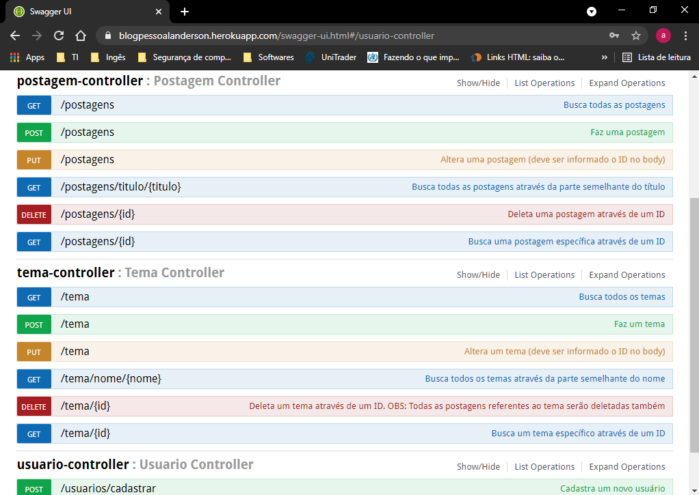
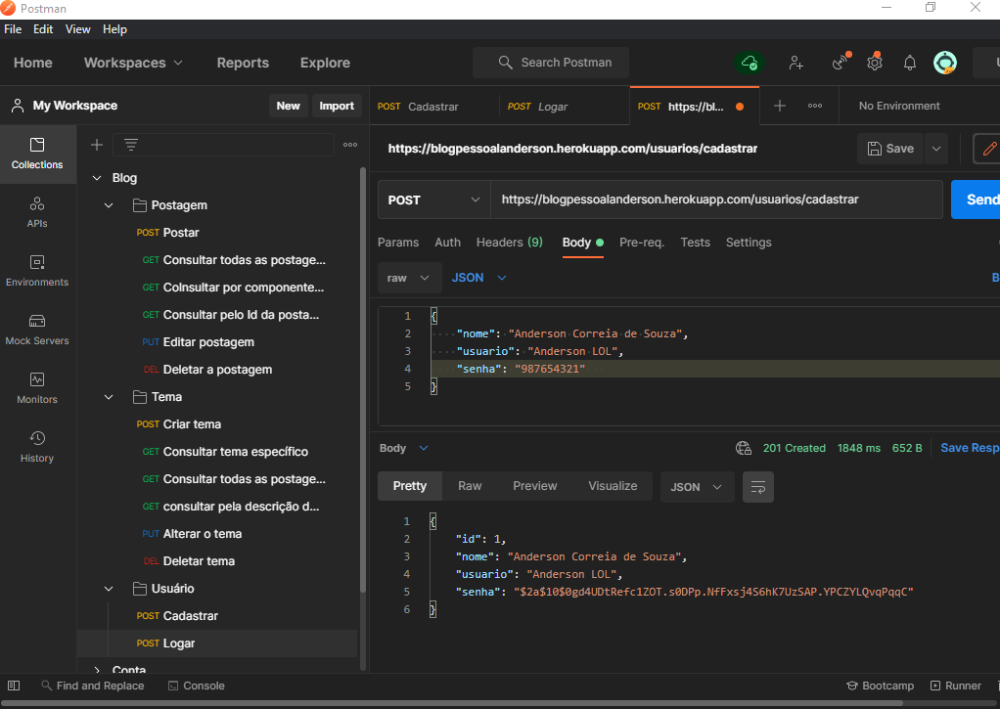
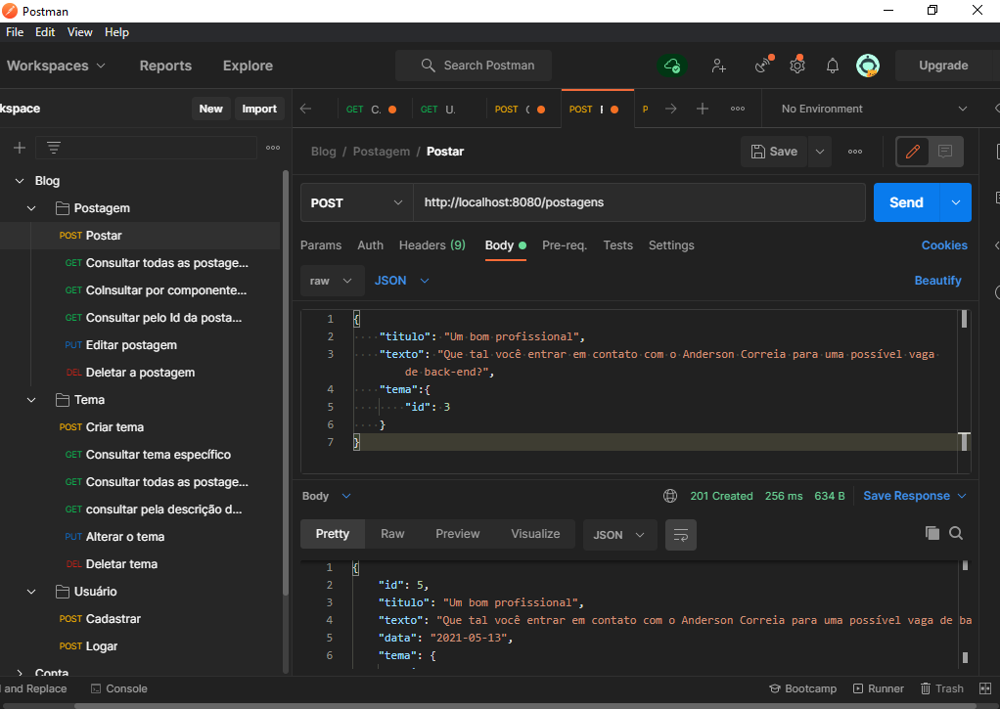
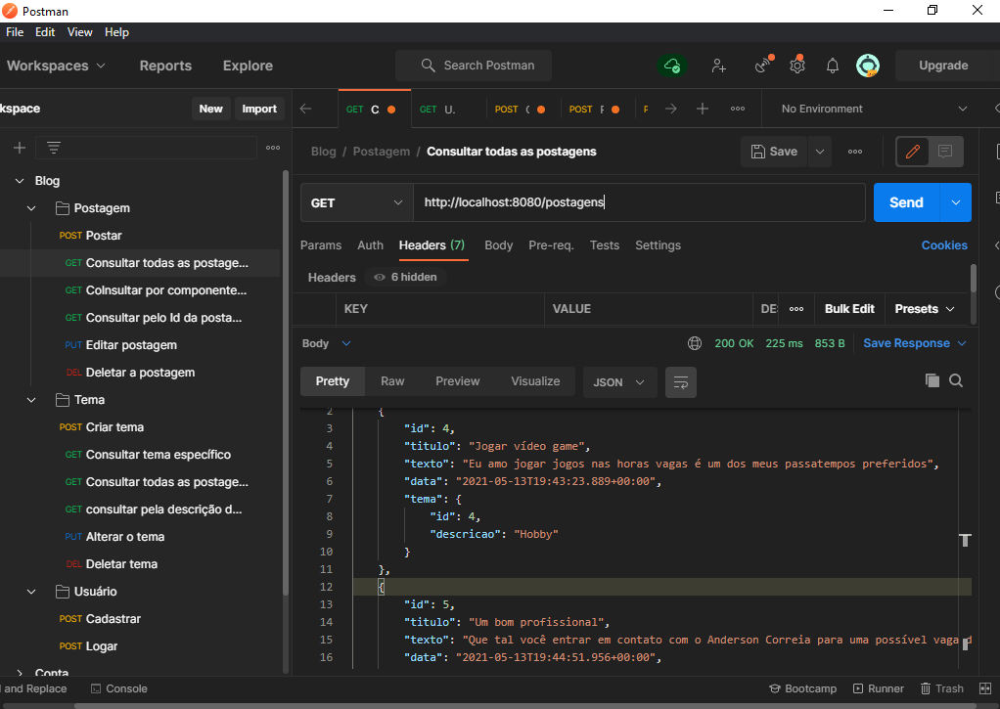

<h1 align="center">Blog Pessoal - API REST</h1>

Em desenvolvimento 🛠 

  <a href="#Sobre">Sobre</a> •
  <a href="#Funcionalidades">Funcionalidades</a> •
  <a href="#Executar">Como Executar</a> •
  <a href="#Tecnologias">Tecnologias</a> •
  <a href="#Autor">Autor</a> •
  <a href="#Licenca">Licença</a>

<h2 id="Sobre">:computer: Sobre o projeto</h2>

  Blog Pessoal - API REST: Este é um projeto back-end voltado para um blog pessoal, com ele você pode desabafar problemas, registrar uma bela conquista e guardar todos os momentos que você quiser da sua vida em formato de texto.

  Esse projeto foi um exercício da <a href="https://brazil.generation.org/">Generation Brasil</a> para que os alunos pudessem praticar os conhecimentos das tecnologias de back-end, ensinados no módulo 2 do curso.

<h2 id="Funcionalidades">⚙️ Funcionalidades</h2>

<h3>Usuário</h3>

  - [x] Cadastrar usuário
  - [x] Logar

<h3>Postagem:</h3>

  - [x] Postar
  - [x] Consultar todas as postagens
  - [x] Consultar postagens com base no título
  - [x] Consultar postagem específica através de um ID
  - [x] Alterar postagem
  - [x] Deletar postagem

<h3>Tema</h3>

  - [x] Criar tema
  - [x] Consultar todas os temas
  - [x] Consultar tema por nome parecido
  - [x] Consultar tema através de um ID
  - [x] Alterar cadastro de tema
  - [x] Deletar cadastro de tema

Endpoints para as funcionalidades: 

Cadastrar um novo usuário: 

Fazer uma postagem: 

Consultar todas as postagens: 

<h2 id="Executar">🚀 Como executar o projeto</h2>

Você pode ler a documentação e testar a api acessando o swagger do projeto no meu heroku clicando <a href="https://blogpessoalanderson.herokuapp.com/swagger-ui.html#/">aqui</a>. Caso a aplicação pedir para logar, use:

<ul>
  <li>Usuário: Anderson LOL</li>
  <li>Senha: 987654321</li>
</ul>
 

Caso você queira usar o Postman para testar o projeto basta usar a url: https://blogpessoalanderson.herokuapp.com. Como a aplicação tem uma camada de segurança você terá que seguir os seguintes passos para ter acesso total aos endpoints:

<ol>
  <li>Usar o endpoint de cadastro de usuário (/usuarios/cadastrar) para criar um usuário</li>
  <li>Usar o endpoint de logar (/usuarios/logar) para gerar  token</li>
  <li>Utilize o token, gerado na etapa anterior, no cabeçalho das requisições dos demais endpoints que estão bloqueados. Basta ir em Headers e criar um atributo chamado Authorization e passar o valor do token nele</li>
</ol>

<h2 id="Tecnologias">🛠 Tecnologias</h2>

Utilitários:

<h2 id="Autor">🦸 Autor</h2>

Anderson Correia é um entusiasta e apaixonados por programação, focado em resolver problemas através de códigos.

Esse projeto foi feito com muito ❤️ e carinho pelo Anderson 👋🏽 <a href="https://www.linkedin.com/in/anderson-correia/">Entre em contato!</a>

<h2 id="Licenca">📝 Licença</h2>

Este projeto esta sob a licença <a href="https://github.com/Anderson815/Blog_Pessoal_-_API_REST/blob/3a908c332bf467de5839252cde0c9d84eec499f3/LICENSE">MIT</a>.

